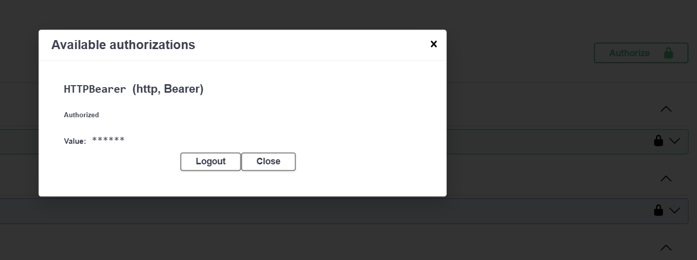
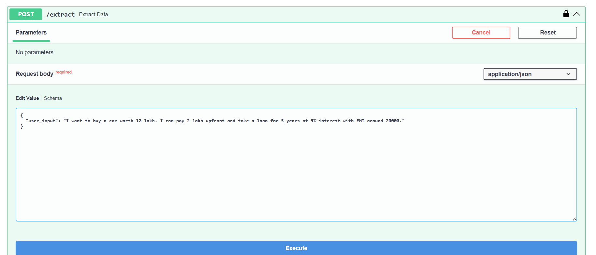

#  AI Financial Data Analyzer

## 📌 Overview

AI Financial Data Analyzer is a FastAPI-based backend application that extracts, processes, and analyzes financial information from user input using AI-driven logic. The system converts unstructured financial text into structured insights, stores results, and maintains logs for tracking.

---

## 📸 Screenshots

### API Documentation (Swagger UI)



### Example Output



---

## 🎯 Features

* 📊 Extract financial data from natural language input
* 🤖 AI-powered data processing and analysis
* 🗂️ Structured REST API endpoints
* 📁 Logging system (error.log, success.log)
* 💾 SQLite database integration
* 📈 CSV and JSON data storage & handling

---

## 🛠️ Tech Stack

* **Backend:** Python, FastAPI
* **Database:** SQLite
* **Libraries:** Pydantic, Uvicorn
* **Others:** Logging, CSV handling, JSON processing

---

## 📂 Project Structure

```
app/
 ├── core/          # Configuration, database, security
 ├── models/        # Database models & schemas
 ├── routes/        # API endpoints
 ├── services/      # AI processing logic
 ├── utils/         # Helper utilities (logger, CSV handler)
 └── main.py        # FastAPI entry point

data/               # Database & datasets
logs/               # Application logs
Image/              # Screenshots
requirements.txt    # Dependencies
```

---

## ⚙️ Installation & Setup

### 1️⃣ Clone the repository

```bash
git clone https://github.com/Yug-Vahanka/AI-Financial-Data-Analyzer.git
cd AI-Financial-Data-Analyzer
```

### &#x20;2️⃣    Install dependencies

```bash
pip install -r requirements.txt
```

---

## ▶️ Run the Application

```bash
uvicorn app.main:app --reload
```

👉 Open in browser:

```
http://127.0.0.1:8000
```

👉 API Docs (Swagger UI):

```
http://127.0.0.1:8000/docs
```

---

## 🔗 API Endpoints

* **GET /** → Check API status
* **POST /extract** → Extract financial insights from user input
* **GET /records** → Retrieve stored financial records

---

## ⚙️ How It Works

1. User sends financial text input
2. FastAPI receives request
3. AI service extracts key financial values
4. Data is structured and processed
5. Results are stored in database
6. Logs are generated for monitoring

---

## 🔒 Security Note

* `.env` file is excluded using `.gitignore`
* Sensitive information is not pushed to GitHub

---

## 🎓 Use Cases

* Financial planning analysis
* Loan & EMI estimation systems
* AI-based data extraction projects
* Backend API development practice

---

## 🚀 Future Improvements

* Add Streamlit UI for frontend
* Deploy project on cloud (Render/AWS)
* Add user authentication system
* Improve AI accuracy and validation

---

## 👨‍💻 Author

**Yug Vahanka**

---

## ⭐ Support

If you like this project, consider giving it a ⭐ on GitHub!
